# OKD Homelab Complete Setup Plan

## Quick Navigation

### Network Documentation
- [network/](network/) - All network configuration documentation
  - [OPNsense-FIREWALL/](network/OPNsense-FIREWALL/) - Firewall configuration (VLANs, DHCP, DNS, HAProxy, VIPs)
  - [TRENDnet-SWITCH/](network/TRENDnet-SWITCH/) - Switch configuration
  - [VLANs/](network/VLANs/) - VLAN implementation guides

### Physical Infrastructure
- [physical/](physical/) - Rack mounting and hardware setup documentation

### Key Configuration Files
- [VLAN Implementation Checklist](network/VLANs/VLAN_IMPLEMENTATION_CHECKLIST.md)
- [OPNSense VLAN Configuration](network/OPNsense-FIREWALL/OPNSense_VLAN_Configuration_Details.md)
- [OPNSense KEA DHCP Setup](network/OPNsense-FIREWALL/OPNSense_KEA_DHCP_Configuration.md)
- [Switch Configuration Guide](network/TRENDnet-SWITCH/TRENDnet_TEG3102WS_Switch_Configuration.md)
- [Rack Mounting Plan](physical/rackmount-plan.md)

---

## Hardware Inventory

### Networking Equipment
- **Firewall**: Protectli VP2430 running OPNSense (4x 2.5G ports)
- **Main Switch**: TRENDnet TEG-3102WS 10-port multi-gig (8x 2.5G, 2x 10G)
- **WiFi APs**: 2x Netgear RBK50 running OpenWRT (Voxel firmware) in mesh
- **KVM**: Raspberry Pi with GL.iNet Comet (GL-RM1) Remote KVM
- **Helium Hotspot**: Connected directly to OPNSense (separate 2.5G port)

### Compute & Storage
- **Storage Node**: Minisforum N5 Pro
  - 96GB RAM
  - 3x 28TB HDD Seagate {HAMR} (ZFS - RAIDZ1)
  - 2x 4TB Crucial P310 4TB SSD, PCIe Gen4 NVMe SSDs (ZFS - mirrored)
  - Running TrueNAS SCALE (Community Edition)
  
- **OKD Cluster Nodes**: 3x Minisforum UM890
  - 96GB RAM each
  - 512GB SSD each
  - Role: Control Plane + Worker (compact cluster)

---

## Network Map

```mermaid
graph TB
    subgraph Internet
        WAN[Internet]
    end

    subgraph "Protectli VP2430 - OPNSense Firewall"
        FW[OPNSense<br/>HAProxy Load Balancer<br/>VLAN Router]
        VIP1[VIP: 10.0.20.5<br/>API]
        VIP2[VIP: 10.0.20.6<br/>Apps Internal]
        VIP3[VIP: 10.0.40.10<br/>Apps External]
    end

    subgraph "TRENDnet TEG-3102WS Switch"
        SW1[Core Switch<br/>VLANs: 1,20,30,40,50,60,99]
    end

    subgraph "VLAN 1 - Management<br/>10.0.1.0/24"
        SW1M[Switch Mgmt<br/>10.0.1.2]
        TNM[TrueNAS Mgmt<br/>10.0.1.4]
        PI[Pi + KVM<br/>10.0.1.10<br/>Tailscale]
        AP1M[WiFi AP1<br/>10.0.1.21]
        AP2M[WiFi AP2<br/>10.0.1.22]
        PC[Your Workstation<br/>10.0.1.100]
        TV[TV/Living Room<br/>DHCP]
    end

    subgraph "VLAN 20 - OKD Infrastructure<br/>10.0.20.0/24"
        TN20[TrueNAS<br/>10.0.20.2<br/>DNS/HTTP]
        M1[Master1<br/>10.0.20.11<br/>UM890]
        M2[Master2<br/>10.0.20.12<br/>UM890]
        M3[Master3<br/>10.0.20.13<br/>UM890]
        BOOT[Bootstrap<br/>10.0.20.10<br/>Temporary]
    end

    subgraph "VLAN 30 - Storage Backend<br/>10.0.30.0/24"
        TN30[TrueNAS Storage<br/>10.0.30.2<br/>NFS/iSCSI]
        M1S[Master1 Storage<br/>10.0.30.11]
        M2S[Master2 Storage<br/>10.0.30.12]
        M3S[Master3 Storage<br/>10.0.30.13]
    end

    subgraph "VLAN 40 - Services<br/>10.0.40.0/24"
        SVC[Services VIP<br/>10.0.40.10<br/>HAProxy → OKD Apps]
    end

    subgraph "VLAN 50 - IoT/Surveillance<br/>10.0.50.0/24"
        IOT[IoT Devices<br/>DHCP]
        CAM[Surveillance Cameras<br/>DHCP]
    end

    subgraph "VLAN 60 - Game Consoles<br/>10.0.60.0/24"
        GAME1[Gaming Console 1<br/>DHCP<br/>uPNP]
        GAME2[Gaming Console 2<br/>DHCP<br/>uPNP]
    end

    subgraph "VLAN 70 - Helium Hotspot<br/>10.0.70.0/24"
        HELIUM[Helium Miner<br/>Direct to OPNSense]
    end

    subgraph "VLAN 99 - Guest WiFi<br/>10.0.99.0/24"
        GUEST[Guest Devices<br/>DHCP<br/>Isolated]
    end

    subgraph "TrueNAS SCALE - N5 Pro<br/>96GB RAM, 2x4TB NVMe, 3x28TB HDD"
        TNFAST[fast-pool<br/>NVMe Mirror<br/>Containers/VMs]
        TNBULK[bulk-pool<br/>RAIDZ1/RAIDZ2<br/>OKD Storage]
        BIND[Bind9 DNS<br/>Container]
        NGINX[Nginx HTTP<br/>Container]
        NFS[NFS Service]
    end

    subgraph "WiFi Access Points (OpenWRT)"
        AP1[WiFi AP 1<br/>SSIDs: Home/IoT/Guest]
        AP2[WiFi AP 2<br/>SSIDs: Home/IoT/Guest]
    end

    subgraph "OKD Cluster Pods"
        POD1[Web Apps]
        POD2[Services]
        POD3[Registry]
    end

    subgraph "Remote Access"
        TS[Tailscale VPN<br/>100.64.0.0/10]
        REMOTE[Remote Users]
    end

    %% Internet Connections
    WAN -->|WAN Port| FW
    
    %% Firewall to Switch
    FW -->|Trunk<br/>All VLANs| SW1
    
    %% Switch to Devices
    SW1 -.->|VLAN 1| SW1M
    SW1 -.->|VLAN 1| TNM
    SW1 -.->|VLAN 1| PI
    SW1 -.->|VLAN 1| AP1M
    SW1 -.->|VLAN 1| AP2M
    SW1 -.->|VLAN 1| PC
    SW1 -.->|VLAN 1| TV
    SW1 -.->|VLAN 20| TN20
    SW1 -.->|VLAN 20| M1
    SW1 -.->|VLAN 20| M2
    SW1 -.->|VLAN 20| M3
    SW1 -.->|VLAN 30| TN30
    SW1 -.->|VLAN 30| M1S
    SW1 -.->|VLAN 30| M2S
    SW1 -.->|VLAN 30| M3S
    SW1 -.->|VLAN 60| GAME1
    SW1 -.->|VLAN 60| GAME2
    
    %% Helium Hotspot (Direct to OPNSense)
    FW -->|VLAN 70| HELIUM
    
    %% WiFi APs to Clients
    AP1 -.->|VLAN 1| PC
    AP1 -.->|VLAN 1| TV
    AP2 -.->|VLAN 1| PC
    AP1 -.->|VLAN 50| IOT
    AP1 -.->|VLAN 50| CAM
    AP2 -.->|VLAN 50| IOT
    AP1 -.->|VLAN 99| GUEST
    AP2 -.->|VLAN 99| GUEST
    
    %% TrueNAS Internal
    TN20 --> BIND
    TN20 --> NGINX
    TN30 --> NFS
    TNFAST --> BIND
    TNFAST --> NGINX
    TNBULK --> NFS
    
    %% HAProxy VIPs
    FW --> VIP1
    FW --> VIP2
    FW --> VIP3
    
    %% HAProxy to Masters
    VIP1 -.->|API<br/>6443| M1
    VIP1 -.->|API<br/>6443| M2
    VIP1 -.->|API<br/>6443| M3
    VIP2 -.->|Ingress<br/>80/443| M1
    VIP2 -.->|Ingress<br/>80/443| M2
    VIP2 -.->|Ingress<br/>80/443| M3
    VIP3 -.->|Ingress<br/>80/443| M1
    VIP3 -.->|Ingress<br/>80/443| M2
    VIP3 -.->|Ingress<br/>80/443| M3
    
    %% Storage Connections
    NFS -.->|NFS<br/>2049| M1S
    NFS -.->|NFS<br/>2049| M2S
    NFS -.->|NFS<br/>2049| M3S
    
    %% Masters to Pods
    M1 --> POD1
    M2 --> POD2
    M3 --> POD3
    
    %% Tailscale
    REMOTE --> TS
    TS -.->|VPN| PI
    TS -.->|Subnet Routes| FW
    
    %% Client Access to Services
    PC -.->|HTTPS| SVC
    TV -.->|HTTPS| SVC
    
    %% Styling
    classDef firewall fill:#ff6b6b,stroke:#c92a2a,stroke-width:3px,color:#fff
    classDef switch fill:#4ecdc4,stroke:#087f5b,stroke-width:2px,color:#000
    classDef server fill:#95e1d3,stroke:#0ca678,stroke-width:2px,color:#000
    classDef storage fill:#ffd93d,stroke:#f08c00,stroke-width:2px,color:#000
    classDef client fill:#a8dadc,stroke:#457b9d,stroke-width:2px,color:#000
    classDef vip fill:#b794f4,stroke:#6b46c1,stroke-width:2px,color:#fff
    classDef vlan fill:#e9ecef,stroke:#868e96,stroke-width:1px,color:#000
    classDef remote fill:#f783ac,stroke:#e64980,stroke-width:2px,color:#000
    
    class FW firewall
    class SW1,SW2 switch
    class M1,M2,M3,TN20,TN30 server
    class TNFAST,TNBULK,NFS storage
    class PC,TV,IOT,CAM,GAME1,GAME2,HELIUM,GUEST client
    class VIP1,VIP2,VIP3,SVC vip
    class TS,REMOTE remote
```



## Network Architecture

### VLAN Design

| VLAN | Name | Subnet | Purpose | Devices |
|------|------|---------|---------|---------|
| 1 | Management | 10.0.1.0/24 | Infrastructure, workstations, living room | OPNSense, switches, APs, TrueNAS mgmt, Pi KVM, desktop, TV |
| 20 | OKD-Infra | 10.0.20.0/24 | OKD cluster nodes | 3x UM890, bootstrap, DNS |
| 30 | OKD-Storage | 10.0.30.0/24 | Storage backend (isolated) | TrueNAS NFS/iSCSI |
| 40 | Services | 10.0.40.0/24 | Published OKD services | HAProxy VIP |
| 50 | IoT/Surveillance | 10.0.50.0/24 | IoT devices, cameras | WiFi SSID: Home-IoT |
| 60 | Game Consoles | 10.0.60.0/24 | Gaming consoles (uPNP enabled) | Wired gaming devices |
| 70 | Helium Hotspot | 10.0.70.0/24 | Helium miner | Direct to OPNSense |
| 99 | Guest-WiFi | 10.0.99.0/24 | Isolated guest network | WiFi SSID: Guest |

### IP Allocation

#### VLAN 1 - Management (10.0.1.0/24)
- Gateway: 10.0.1.1 (OPNSense)
- Main Switch: 10.0.1.2
- TrueNAS Management: 10.0.1.4
- Raspberry Pi + KVM: 10.0.1.10
- WiFi AP 1: 10.0.1.21
- WiFi AP 2: 10.0.1.22
- Your Workstation: 10.0.1.100
- DHCP Range: 10.0.1.100-250
- TV/Living Room Devices: DHCP

#### VLAN 20 - OKD Infrastructure (10.0.20.0/24)
- Gateway: 10.0.20.1
- TrueNAS (Helper): 10.0.20.2 (DNS, HTTP)
- API VIP: 10.0.20.5 (HAProxy)
- Apps VIP (Internal): 10.0.20.6 (HAProxy)
- Bootstrap: 10.0.20.10 (temporary)
- Master1: 10.0.20.11
- Master2: 10.0.20.12
- Master3: 10.0.20.13

#### VLAN 30 - Storage Backend (10.0.30.0/24)
- Gateway: 10.0.30.1
- TrueNAS Storage: 10.0.30.2
- Master1 Storage: 10.0.30.11
- Master2 Storage: 10.0.30.12
- Master3 Storage: 10.0.30.13

#### VLAN 40 - Services (10.0.40.0/24)
- Gateway: 10.0.40.1
- OKD Apps VIP: 10.0.40.10 (HAProxy → OKD Ingress)

#### VLAN 50 - IoT/Surveillance (10.0.50.0/24)
- Gateway: 10.0.50.1
- DHCP Range: 10.0.50.100-200
- WiFi AP 1: 10.0.50.10
- WiFi AP 2: 10.0.50.11

#### VLAN 60 - Game Consoles (10.0.60.0/24)
- Gateway: 10.0.60.1
- DHCP Range: 10.0.60.100-200
- uPNP: Enabled (automatic port forwarding)

#### VLAN 70 - Helium Hotspot (10.0.70.0/24)
- Gateway: 10.0.70.1
- DHCP Range: 10.0.70.100-200
- Connected: Direct to OPNSense (separate 2.5G port)

#### VLAN 99 - Guest WiFi (10.0.99.0/24)
- Gateway: 10.0.99.1
- DHCP Range: 10.0.99.100-200

---

## Phase 1: OPNSense Configuration

### 1.1 Create VLAN Interfaces
- Navigate to: Interfaces → Other Types → VLAN
- Create VLANs on the main trunk port (the 2.5G port connected to switch):
  - VLAN 1 (Management) - Parent: Main trunk interface
  - VLAN 20 (OKD-Infra) - Parent: Main trunk interface
  - VLAN 30 (OKD-Storage) - Parent: Main trunk interface
  - VLAN 40 (Services) - Parent: Main trunk interface
  - VLAN 50 (IoT/Surveillance) - Parent: Main trunk interface
  - VLAN 60 (Game Consoles) - Parent: Main trunk interface
  - VLAN 99 (Guest-WiFi) - Parent: Main trunk interface

**Note:** VLAN 70 (Helium) will be on a separate physical interface (the 2.5G port directly connected to Helium hotspot)

**Detailed Configuration:** See `OPNSense_VLAN_Configuration_Details.md` for complete field-by-field configuration for each VLAN interface.

### 1.2 Assign VLAN Interfaces
- Navigate to: Interfaces → Assignments
- For each VLAN (1, 20, 30, 40, 50, 60, 99):
  1. Click "+" to add new interface
  2. Select the VLAN interface
  3. Enable the interface
  4. Configure static IP:
     - VLAN 1: 10.0.1.1/24
     - VLAN 20: 10.0.20.1/24
     - VLAN 30: 10.0.30.1/24
     - VLAN 40: 10.0.40.1/24
     - VLAN 50: 10.0.50.1/24
     - VLAN 60: 10.0.60.1/24
     - VLAN 99: 10.0.99.1/24

**Detailed Configuration:** See `OPNSense_VLAN_Assignment_Details.md` for complete field-by-field configuration for assigning and configuring each VLAN interface.

### 1.3 Configure Helium Hotspot Interface
- Navigate to: Interfaces → Assignments
- Assign the physical 2.5G port connected to Helium hotspot
- Enable interface
- Configure static IP: 10.0.70.1/24
- Description: "Helium Hotspot"

### 1.4 Configure KEA DHCP v4 Services
- Navigate to: Services → Kea DHCP → Settings
- Enable KEA DHCP service
- Navigate to: Services → Kea DHCP → DHCPv4
- Create DHCP subnets for:
  - **VLAN 1 (Management):** 10.0.1.100-250
  - **VLAN 50 (IoT/Surveillance):** 10.0.50.100-200
  - **VLAN 60 (Game Consoles):** 10.0.60.100-200
  - **VLAN 70 (Helium):** 10.0.70.100-200
  - **VLAN 99 (Guest):** 10.0.99.100-200
- Configure Option Data for each subnet:
  - Routers (gateway): VLAN gateway IP
  - Domain Name Servers: 10.0.20.2 (TrueNAS), 10.0.1.1 (OPNSense Unbound)
  - Domain Name: lab (optional)

**Detailed Configuration:** 
- See `OPNSense_KEA_DHCP_Configuration.md` for complete field-by-field configuration for KEA DHCP v4
- See `OPNSense_KEA_DHCP_By_VLAN_Name.md` for quick reference organized by VLAN names (Management, Guest, etc.)

### 1.5 Enable uPNP for Game Consoles VLAN
- Navigate to: Services → UPnP & NAT-PMP
- Enable UPnP & NAT-PMP
- Interfaces: Select VLAN 60 (Game Consoles)
- Allow UPnP: Enable
- Default deny: Enable (only allow what's requested)
- Log packets: Optional (for troubleshooting)

**Important:** This allows game consoles to automatically open ports via uPNP while keeping them isolated from other VLANs.

### 1.6 Install HAProxy Plugin
- Navigate to: System → Firmware → Plugins
- Search for: `os-haproxy`
- Click install
- Enable HAProxy: Services → HAProxy → Settings

### 1.7 Create Virtual IPs
- Navigate to: Interfaces → Virtual IPs → Settings

**API VIP (VLAN 20):**
- Mode: IP Alias
- Interface: OKDInfra (VLAN20)
- Network / Address: 10.0.20.5/24
- Gateway: (Leave empty)
- Deny service binding: Unchecked
- Description: OKD API VIP - Load balances API requests to master nodes

**Apps VIP Internal (VLAN 20):**
- Mode: IP Alias
- Interface: OKDInfra (VLAN20)
- Network / Address: 10.0.20.6/24
- Gateway: (Leave empty)
- Deny service binding: Unchecked
- Description: OKD Apps Internal VIP - Load balances internal app requests

**Apps VIP Services (VLAN 40):**
- Mode: IP Alias
- Interface: Services (VLAN40)
- Network / Address: 10.0.40.10/24
- Gateway: (Leave empty)
- Deny service binding: Unchecked
- Description: OKD Apps External Access - Published OKD services

**Detailed Configuration:** See `OPNSense_Virtual_IP_Configuration.md` for complete field-by-field configuration for all Virtual IPs.

### 1.8 Configure HAProxy Backends
- Navigate to: Services → HAProxy → Settings → Backend

**Backend 1: okd_api_backend**
- Mode: TCP
- Balance: roundrobin
- Health check: SSL
- Servers:
  - bootstrap: 10.0.20.10:6443 (SSL, no verify)
  - master1: 10.0.20.11:6443 (SSL, no verify)
  - master2: 10.0.20.12:6443 (SSL, no verify)
  - master3: 10.0.20.13:6443 (SSL, no verify)

**Backend 2: okd_machine_config_backend**
- Mode: TCP
- Balance: roundrobin
- Health check: SSL
- Servers:
  - bootstrap: 10.0.20.10:22623 (SSL, no verify)
  - master1: 10.0.20.11:22623 (SSL, no verify)
  - master2: 10.0.20.12:22623 (SSL, no verify)
  - master3: 10.0.20.13:22623 (SSL, no verify)

**Backend 3: okd_ingress_http_backend**
- Mode: TCP
- Balance: roundrobin
- Health check: TCP
- Servers:
  - master1: 10.0.20.11:80
  - master2: 10.0.20.12:80
  - master3: 10.0.20.13:80

**Backend 4: okd_ingress_https_backend**
- Mode: TCP
- Balance: roundrobin
- Health check: SSL
- Servers:
  - master1: 10.0.20.11:443 (SSL, no verify)
  - master2: 10.0.20.12:443 (SSL, no verify)
  - master3: 10.0.20.13:443 (SSL, no verify)

### 1.9 Configure HAProxy Frontends
- Navigate to: Services → HAProxy → Settings → Frontend

**Frontend 1: okd_api_frontend**
- Listen: 10.0.20.5:6443
- Type: TCP
- Backend: okd_api_backend

**Frontend 2: okd_machine_config_frontend**
- Listen: 10.0.20.5:22623
- Type: TCP
- Backend: okd_machine_config_backend

**Frontend 3: okd_http_internal_frontend**
- Listen: 10.0.20.6:80
- Type: TCP
- Backend: okd_ingress_http_backend

**Frontend 4: okd_https_internal_frontend**
- Listen: 10.0.20.6:443
- Type: TCP
- Backend: okd_ingress_https_backend

**Frontend 5: okd_http_services_frontend**
- Listen: 10.0.40.10:80
- Type: TCP
- Backend: okd_ingress_http_backend

**Frontend 6: okd_https_services_frontend**
- Listen: 10.0.40.10:443
- Type: TCP
- Backend: okd_ingress_https_backend

### 1.10 Configure Firewall Rules

#### VLAN 1 (Management)
- Allow: All traffic within VLAN 1 (intra-VLAN communication)
- Allow: TCP to 10.0.40.10:80,443 (OKD Services)
- Allow: TCP to 10.0.20.5:6443 (OKD API for kubectl)
- Allow: TCP to 10.0.1.4:443 (TrueNAS UI)
- Allow: To !RFC1918 (Internet)
- Default deny: Everything else

#### VLAN 20 (OKD-Infra)
- Allow: Any to VLAN20 net (cluster mesh)
- Allow: TCP to VLAN30 net:2049,111,3260 (NFS/iSCSI)
- Allow: To !RFC1918 (Internet for image pulls)
- Default deny: Everything else

#### VLAN 30 (OKD-Storage)
- Allow: TCP from VLAN20 net:2049,111,3260 (Storage protocols only)
- Default deny: Everything else (highly isolated)

#### VLAN 40 (Services)
- Allow: Established/related connections
- (VIP only, no hosts on this VLAN)

#### VLAN 50 (IoT/Surveillance)
- Allow: UDP to 10.0.20.2,10.0.1.1:53 (DNS)
- Allow: To !RFC1918 (Internet)
- Block: To RFC1918 (isolate from infrastructure)
- **No access to Services VLAN** (cameras don't need web apps)

#### VLAN 60 (Game Consoles)
- Allow: UDP to 10.0.20.2,10.0.1.1:53 (DNS)
- Allow: To !RFC1918 (Internet)
- Block: To RFC1918 (isolate from infrastructure)
- **uPNP will handle port forwarding automatically**
- **No access to Services VLAN**

#### VLAN 70 (Helium Hotspot)
- Allow: To !RFC1918 (Internet only)
- Block: To RFC1918 (isolate from infrastructure)

#### VLAN 99 (Guest-WiFi)
- Allow: To !RFC1918 (Internet only)
- Block: To RFC1918 (complete isolation)

### 1.11 Configure Unbound DNS
- Navigate to: Services → Unbound DNS → General
- Verify Unbound DNS is enabled
- Configure Network Interfaces: Select all VLAN interfaces
- Enable DNS Query Forwarding
- Configure Upstream DNS Servers:
  - Primary: 10.0.20.2 (TrueNAS Bind9)
  - Secondary: 1.1.1.1 (Cloudflare) or 8.8.8.8 (Google)
- Navigate to: Services → Unbound DNS → Overrides
- Add Domain Override:
  - Domain: okd.lab
  - IP: 10.0.20.2
  - Description: Forward to TrueNAS Bind9

**Detailed Configuration:** See `OPNSense_Unbound_DNS_Configuration.md` for complete field-by-field configuration for Unbound DNS.

### 1.12 Configure NAT/Outbound
- Navigate to: Firewall → NAT → Outbound
- Mode: Hybrid or Manual
- Create outbound NAT rules for each VLAN → WAN

---

## Phase 2: TRENDnet TEG-3102WS Switch Configuration

### 2.1 Access Switch Management
- Connect to switch management interface (likely 192.168.0.1 or check switch docs)
- Login with admin credentials

### 2.2 Configure Switch Management IP
- Set static IP: 10.0.1.2/24
- Gateway: 10.0.1.1
- DNS: 10.0.20.2, 10.0.1.1

### 2.3 Create VLANs
**Location:** VLAN → VLAN Configuration

Create VLANs:
- VLAN 1 (Management)
- VLAN 20 (OKD-Infra)
- VLAN 30 (OKD-Storage)
- VLAN 40 (Services)
- VLAN 50 (IoT/Surveillance)
- VLAN 60 (Game Consoles)
- VLAN 99 (Guest-WiFi)

### 2.4 Configure Ports

| Port | Device | Mode | Tagged VLANs | Untagged/PVID |
|------|--------|------|--------------|---------------|
| 1 (2.5G) | OPNSense (trunk) | Trunk | 1,20,30,40,50,60,99 | 1 |
| 2-8 (2.5G) | Available | Access | - | 1 (Management) |
| 9 (10G) | TrueNAS | Trunk | 1,20,30,40 | 1 |
| 10 (10G) | Desktop | Access | - | 1 (Management) |

**Port 1 (OPNSense Trunk):**
- Mode: Trunk/Tagged
- Tagged VLANs: 1,20,30,40,50,60,99
- PVID: 1

**Port 9 (TrueNAS):**
- Mode: Trunk/Tagged
- Tagged VLANs: 1,20,30,40
- PVID: 1

**Ports 2-8, 10 (Access ports):**
- Mode: Access/Untagged
- PVID: 1 (Management VLAN)

**Note:** WiFi APs will connect to access ports and handle VLAN tagging internally via OpenWRT.

### 2.5 Configure Port for Game Consoles (if needed)
If you have a dedicated port for game consoles:
- Set port to Access mode
- PVID: 60 (Game Consoles VLAN)

**Detailed Configuration:** See `TRENDnet_TEG3102WS_Switch_Configuration.md` for complete step-by-step configuration with all field details.

---

## Phase 3: TrueNAS SCALE Setup

### 3.1 Install TrueNAS SCALE
- Download latest TrueNAS SCALE ISO
- Create bootable USB
- Boot N5 Pro from USB
- Install to one NVMe drive
- Set admin password
- Reboot

### 3.2 Configure Network Interfaces
- Access web UI at initial IP
- Navigate to: Network → Interfaces

**Configure VLANs:**
- VLAN 1: 10.0.1.4/24 (Management)
- VLAN 20: 10.0.20.2/24 (OKD Infra - Gateway: 10.0.20.1)
- VLAN 30: 10.0.30.2/24 (Storage - No gateway)
- VLAN 40: 10.0.40.2/24 (Services - Gateway: 10.0.40.1)

### 3.3 Create ZFS Pools
- Navigate to: Storage → Create Pool

**Pool 1: fast-pool (NVMe)**
- Name: fast-pool
- Layout: Mirror
- Devices: 2x 4TB NVMe drives

**Pool 2: bulk-pool (HDD)**
- Name: bulk-pool
- Layout: RAIDZ1 (or RAIDZ2 for more safety)
- Devices: 3x 28TB HDDs

### 3.4 Create Datasets
- Navigate to: Datasets

**On fast-pool:**
- fast-pool/apps (for containers)
- fast-pool/vms (for future VMs)

**On bulk-pool:**
- bulk-pool/okd-storage (for OKD PVs)
- bulk-pool/okd-registry (for OKD image registry)

**Set properties:**
- Compression: LZ4
- Record Size: 128K

### 3.5 Enable SSH
- Navigate to: System Settings → Services
- Enable SSH service
- Start automatically: Yes

### 3.6 Deploy Helper Services Container
- SSH to TrueNAS: `ssh admin@10.0.20.2`
- Create directory structure:

```bash
sudo mkdir -p /mnt/fast-pool/apps/okd-helper
cd /mnt/fast-pool/apps/okd-helper
mkdir -p bind/config bind/cache haproxy nginx/html nginx/html/okd
```

**Create docker-compose.yml:**
```yaml
version: '3.8'

services:
  bind9:
    image: ubuntu/bind9:latest
    container_name: okd-dns
    network_mode: "host"
    volumes:
      - ./bind/config:/etc/bind
      - ./bind/cache:/var/cache/bind
    restart: unless-stopped
    environment:
      - BIND9_USER=root
      - TZ=America/New_York

  nginx:
    image: nginx:alpine
    container_name: okd-nginx
    network_mode: "host"
    volumes:
      - ./nginx/html:/usr/share/nginx/html:ro
      - ./nginx/nginx.conf:/etc/nginx/nginx.conf:ro
    restart: unless-stopped
```

### 3.7 Configure DNS (Bind9)

**bind/config/named.conf:**
```conf
options {
    directory "/var/cache/bind";
    listen-on port 53 { 127.0.0.1; 10.0.20.2; };
    allow-query { localhost; 10.0.1.0/24; 10.0.20.0/24; 10.0.50.0/24; 10.0.60.0/24; };
    recursion yes;
    forwarders { 10.0.20.1; 1.1.1.1; 8.8.8.8; };
    dnssec-validation no;
};

zone "okd.lab" {
    type master;
    file "/etc/bind/okd.lab.zone";
};

zone "20.0.10.in-addr.arpa" {
    type master;
    file "/etc/bind/20.0.10.rev";
};
```

**bind/config/okd.lab.zone:**
```zone
$TTL 86400
@   IN  SOA ns1.okd.lab. admin.okd.lab. (
            2024010101  ; Serial
            3600        ; Refresh
            1800        ; Retry
            604800      ; Expire
            86400 )     ; Minimum TTL

; Name servers
@           IN  NS  ns1.okd.lab.
ns1         IN  A   10.0.20.2

; Infrastructure
helper      IN  A   10.0.20.2
truenas     IN  A   10.0.20.2

; Load Balancer VIPs
api         IN  A   10.0.20.5
api-int     IN  A   10.0.20.5
*.apps      IN  A   10.0.40.10

; Bootstrap
bootstrap   IN  A   10.0.20.10

; Masters
master1     IN  A   10.0.20.11
master2     IN  A   10.0.20.12
master3     IN  A   10.0.20.13

; etcd
etcd-0      IN  A   10.0.20.11
etcd-1      IN  A   10.0.20.12
etcd-2      IN  A   10.0.20.13

; SRV Records for etcd
_etcd-server-ssl._tcp   IN  SRV 0 10 2380 etcd-0.okd.lab.
_etcd-server-ssl._tcp   IN  SRV 0 10 2380 etcd-1.okd.lab.
_etcd-server-ssl._tcp   IN  SRV 0 10 2380 etcd-2.okd.lab.
```

**bind/config/20.0.10.rev:**
```zone
$TTL 86400
@   IN  SOA ns1.okd.lab. admin.okd.lab. (
            2024010101
            3600
            1800
            604800
            86400 )

@       IN  NS  ns1.okd.lab.

2       IN  PTR helper.okd.lab.
2       IN  PTR truenas.okd.lab.
2       IN  PTR ns1.okd.lab.
5       IN  PTR api.okd.lab.
5       IN  PTR api-int.okd.lab.
10      IN  PTR bootstrap.okd.lab.
11      IN  PTR master1.okd.lab.
12      IN  PTR master2.okd.lab.
13      IN  PTR master3.okd.lab.
```

### 3.8 Configure Nginx

**nginx/nginx.conf:**
```nginx
events {
    worker_connections 1024;
}

http {
    include /etc/nginx/mime.types;
    default_type application/octet-stream;
    
    server {
        listen 10.0.20.2:8080;
        server_name _;
        
        location /okd/ {
            root /usr/share/nginx/html;
            autoindex on;
        }
    }
}
```

### 3.9 Start Services
```bash
sudo apt update
sudo apt install docker-compose -y
cd /mnt/fast-pool/apps/okd-helper
sudo docker-compose up -d
```

**Test DNS:**
```bash
dig @10.0.20.2 api.okd.lab
dig @10.0.20.2 test.apps.okd.lab
```

### 3.10 Configure NFS Shares
- Navigate to: Shares → Unix Shares (NFS)

**Share 1: OKD Storage**
- Path: /mnt/bulk-pool/okd-storage
- Networks: 10.0.30.0/24
- Maproot User: root
- Maproot Group: root

**Share 2: OKD Registry**
- Path: /mnt/bulk-pool/okd-registry
- Networks: 10.0.30.0/24
- Maproot User: root
- Maproot Group: root

**Enable NFS Service:**
- System Settings → Services → NFS
- Enable and start automatically

### 3.11 Create Auto-start Script
```bash
sudo nano /root/start-okd-helper.sh
```

```bash
#!/bin/bash
cd /mnt/fast-pool/apps/okd-helper
docker-compose up -d
```

```bash
sudo chmod +x /root/start-okd-helper.sh
```

**Add to init scripts:**
- System Settings → Advanced → Init/Shutdown Scripts
- Command: /root/start-okd-helper.sh
- Type: Command
- When: Post Init

---

## Phase 4: OpenWRT Access Point Configuration (Netgear RBK50)

### 4.1 Access AP Management
- Connect to AP via wired connection (will be on Management VLAN initially)
- Access web UI (likely 192.168.1.1 or check current IP)
- Login with admin credentials

### 4.2 Configure Management Interface
**Location:** Network → Interfaces → LAN

- Protocol: Static
- IP Address: 10.0.1.21 (for AP1) or 10.0.1.22 (for AP2)
- Netmask: 255.255.255.0
- Gateway: 10.0.1.1
- DNS: 10.0.20.2, 10.0.1.1

### 4.3 Configure VLANs on Switch Interface
**Location:** Network → Switch

Configure the switch interface to support VLAN tagging:
- Create VLAN 1 (Management) - untagged on CPU port
- Create VLAN 50 (IoT/Surveillance) - tagged
- Create VLAN 99 (Guest-WiFi) - tagged

### 4.4 Create VLAN Interfaces
**Location:** Network → Interfaces

**VLAN 50 (IoT/Surveillance):**
- Protocol: Static
- Device: eth0.50 (or appropriate VLAN interface)
- IP Address: 10.0.50.10 (AP1) or 10.0.50.11 (AP2)
- Netmask: 255.255.255.0
- Gateway: 10.0.50.1

**VLAN 99 (Guest-WiFi):**
- Protocol: Static (optional, or use bridge without IP)
- Device: eth0.99
- IP Address: Not required (can be unconfigured for guest)

### 4.5 Configure WiFi SSIDs
**Location:** Wireless

**SSID 1: YourHomeNetwork (2.4GHz)**
- Network: LAN (Management VLAN 1)
- Mode: Access Point
- SSID: YourHomeNetwork
- Encryption: WPA3/WPA2
- Key: [Your secure password]
- Network: Bridge to LAN interface

**SSID 2: YourHomeNetwork-5G (5GHz)**
- Network: LAN (Management VLAN 1)
- Mode: Access Point
- SSID: YourHomeNetwork-5G
- Encryption: WPA3/WPA2
- Key: [Same password]
- Network: Bridge to LAN interface

**SSID 3: Home-IoT (2.4GHz)**
- Network: Create new interface "IoT" bridging to VLAN 50
- Mode: Access Point
- SSID: Home-IoT
- Encryption: WPA2 (IoT devices often don't support WPA3)
- Key: [IoT password]
- Network: Bridge to VLAN 50 interface
- Client Isolation: Enable (optional, prevents IoT devices from talking to each other)

**SSID 4: Home-IoT-5G (5GHz)** (if needed)
- Same as above but 5GHz

**SSID 5: Guest (2.4GHz)**
- Network: Create new interface "Guest" bridging to VLAN 99
- Mode: Access Point
- SSID: Guest
- Encryption: WPA2
- Key: [Guest password]
- Network: Bridge to VLAN 99 interface
- Client Isolation: Enable (required for guest network)

**SSID 6: Guest-5G (5GHz)**
- Same as above but 5GHz

### 4.6 Configure Firewall Rules (OpenWRT)
**Location:** Network → Firewall

Ensure firewall rules allow:
- Management VLAN: Full access
- IoT VLAN: Internet only (handled by OPNSense, but AP should forward)
- Guest VLAN: Internet only (handled by OPNSense)

### 4.7 Configure Mesh (if using mesh mode)
**Location:** Network → Wireless → Mesh

- Ensure mesh is configured on Management VLAN (VLAN 1)
- Mesh should work across both APs for Management SSIDs
- IoT and Guest SSIDs may need separate mesh configuration if supported

**Note:** Voxel firmware is based on OpenWRT, so standard OpenWRT configuration applies. If the web UI doesn't support all features, you may need to use SSH and edit `/etc/config/network` and `/etc/config/wireless` directly.

---

## Phase 5: Raspberry Pi KVM Setup

### 5.1 Install Pi on Management VLAN
- Connect Pi to switch port configured for VLAN 1
- Configure static IP: 10.0.1.10
- Gateway: 10.0.1.1
- DNS: 10.0.20.2

### 5.2 Install Tailscale
```bash
curl -fsSL https://tailscale.com/install.sh | sh
sudo tailscale up --advertise-routes=10.0.1.0/24
```

### 5.3 Configure Tailscale Admin Console
- Approve the Pi device
- Enable subnet routes for 10.0.1.0/24
- Set device name: pi-kvm

### 5.4 Configure GL.iNet Comet KVM
- Connect to Pi
- Configure KVM access
- Test remote access via Tailscale

---

## Phase 6: OKD Cluster Installation

### 6.1 Download OKD Tools
SSH to TrueNAS and download:

```bash
cd /mnt/fast-pool/apps/okd-helper/nginx/html/okd
export VERSION=4.14.0-0.okd-2024-01-06-084517

sudo wget https://github.com/okd-project/okd/releases/download/${VERSION}/openshift-install-linux-${VERSION}.tar.gz
sudo wget https://github.com/okd-project/okd/releases/download/${VERSION}/openshift-client-linux-${VERSION}.tar.gz

sudo tar xvf openshift-install-linux-${VERSION}.tar.gz
sudo tar xvf openshift-client-linux-${VERSION}.tar.gz

sudo mv openshift-install oc kubectl /usr/local/bin/
```

### 6.2 Download Fedora CoreOS
```bash
cd /mnt/fast-pool/apps/okd-helper/nginx/html/okd
sudo wget https://builds.coreos.fedoraproject.org/prod/streams/stable/builds/39.20240128.3.0/x86_64/fedora-coreos-39.20240128.3.0-live.x86_64.iso
```

### 6.3 Generate SSH Keys
```bash
ssh-keygen -t ed25519 -N '' -f ~/.ssh/id_okd
cat ~/.ssh/id_okd.pub
```

### 6.4 Create Install Config
```bash
mkdir -p ~/okd-install
cd ~/okd-install
```

**install-config.yaml:**
```yaml
apiVersion: v1
baseDomain: lab
compute:
- name: worker
  replicas: 0
controlPlane:
  name: master
  replicas: 3
metadata:
  name: okd
networking:
  clusterNetwork:
  - cidr: 10.128.0.0/14
    hostPrefix: 23
  networkType: OVNKubernetes
  serviceNetwork:
  - 172.30.0.0/16
platform:
  none: {}
pullSecret: '{"auths":{"fake":{"auth":"REPLACE_ME_AUTH"}}}'
sshKey: 'ssh-ed25519 AAAA... [paste your public key]'
```

### 6.5 Generate Ignition Configs
```bash
cp install-config.yaml install-config.yaml.backup

openshift-install create manifests --dir=.

# Make masters schedulable
sed -i 's/mastersSchedulable: false/mastersSchedulable: true/' \
  manifests/cluster-scheduler-02-config.yml

openshift-install create ignition-configs --dir=.
```

### 6.6 Host Ignition Files
```bash
sudo cp *.ign /mnt/fast-pool/apps/okd-helper/nginx/html/okd/
sudo chmod 644 /mnt/fast-pool/apps/okd-helper/nginx/html/okd/*.ign

# Test
curl http://10.0.20.2:8080/okd/bootstrap.ign
```

### 6.7 Prepare UM890 Nodes
**BIOS Configuration (all 3 nodes):**
- Enable virtualization (VT-x/AMD-V)
- Disable Secure Boot
- Set boot order: Network/USB first

**Network Configuration:**
- Primary NIC: VLAN 20 (OKD Infra)
- Secondary NIC: VLAN 30 (Storage)
- Management: VLAN 1

### 6.8 Install Bootstrap Node
**Option A: Temporary VM on one UM890**
**Option B: Temporary node**

Boot from Fedora CoreOS ISO, press TAB at boot:
```
coreos.inst.install_dev=/dev/nvme0n1 
coreos.inst.ignition_url=http://10.0.20.2:8080/okd/bootstrap.ign 
ip=10.0.20.10::10.0.20.1:255.255.255.0:bootstrap.okd.lab:enp1s0:none 
nameserver=10.0.20.2
```

### 6.9 Install Master Nodes

**Master 1:**
Boot from Fedora CoreOS ISO, press TAB:
```
coreos.inst.install_dev=/dev/nvme0n1 
coreos.inst.ignition_url=http://10.0.20.2:8080/okd/master.ign 
ip=10.0.20.11::10.0.20.1:255.255.255.0:master1.okd.lab:enp1s0:none 
nameserver=10.0.20.2
```

**Master 2:**
```
coreos.inst.install_dev=/dev/nvme0n1 
coreos.inst.ignition_url=http://10.0.20.2:8080/okd/master.ign 
ip=10.0.20.12::10.0.20.1:255.255.255.0:master2.okd.lab:enp1s0:none 
nameserver=10.0.20.2
```

**Master 3:**
```
coreos.inst.install_dev=/dev/nvme0n1 
coreos.inst.ignition_url=http://10.0.20.2:8080/okd/master.ign 
ip=10.0.20.13::10.0.20.1:255.255.255.0:master3.okd.lab:enp1s0:none 
nameserver=10.0.20.2
```

### 6.10 Monitor Bootstrap
```bash
cd ~/okd-install
openshift-install wait-for bootstrap-complete --log-level=debug
```

Wait 15-30 minutes. Once complete, remove bootstrap from HAProxy backends.

### 6.11 Complete Installation
```bash
export KUBECONFIG=~/okd-install/auth/kubeconfig
openshift-install wait-for install-complete
```

Wait another 15-30 minutes. Save the kubeadmin credentials displayed.

---

## Phase 7: Post-Installation Configuration

### 7.1 Configure NFS Storage Class
```bash
export KUBECONFIG=~/okd-install/auth/kubeconfig

kubectl create namespace nfs-provisioner

# Deploy NFS provisioner (see full YAML in original plan)
# Or use Helm:
helm repo add nfs-subdir-external-provisioner \
  https://kubernetes-sigs.github.io/nfs-subdir-external-provisioner/

helm install nfs-provisioner nfs-subdir-external-provisioner/nfs-subdir-external-provisioner \
  --namespace nfs-provisioner \
  --set nfs.server=10.0.30.2 \
  --set nfs.path=/mnt/bulk-pool/okd-storage \
  --set storageClass.defaultClass=true
```

### 7.2 Configure Image Registry
```bash
# Create PVC
oc create -f - <<EOF
apiVersion: v1
kind: PersistentVolumeClaim
metadata:
  name: image-registry-storage
  namespace: openshift-image-registry
spec:
  accessModes:
  - ReadWriteMany
  resources:
    requests:
      storage: 100Gi
  storageClassName: nfs-storage
EOF

# Configure registry
oc patch configs.imageregistry.operator.openshift.io cluster \
  --type merge \
  --patch '{"spec":{"storage":{"pvc":{"claim":"image-registry-storage"}}}}'

oc patch configs.imageregistry.operator.openshift.io cluster \
  --type merge \
  --patch '{"spec":{"managementState":"Managed"}}'
```

### 7.3 Access Web Console
From your workstation (VLAN 1 - Management):

Add to /etc/hosts:
```
10.0.40.10  console-openshift-console.apps.okd.lab
10.0.40.10  oauth-openshift.apps.okd.lab
```

Navigate to: https://console-openshift-console.apps.okd.lab

Login:
- Username: kubeadmin
- Password: [from auth/kubeadmin-password]

### 7.4 Create Admin User (Optional)
```bash
htpasswd -c -B -b users.htpasswd admin 'YourPassword'

oc create secret generic htpass-secret \
  --from-file=htpasswd=users.htpasswd \
  -n openshift-config

cat <<EOF | oc apply -f -
apiVersion: config.openshift.io/v1
kind: OAuth
metadata:
  name: cluster
spec:
  identityProviders:
  - name: htpasswd_provider
    mappingMethod: claim
    type: HTPasswd
    htpasswd:
      fileData:
        name: htpass-secret
EOF

oc adm policy add-cluster-role-to-user cluster-admin admin
```

### 7.5 Verify Cluster Health
```bash
oc get nodes
oc get co
oc get pods --all-namespaces
```

### 7.6 Remove Bootstrap from HAProxy
- Edit HAProxy backends on OPNSense
- Comment out or remove bootstrap server entries
- Reload HAProxy
- Power down bootstrap node

---

## Phase 8: Testing & Validation

### 8.1 Test DNS Resolution
From various VLANs:
```bash
# From workstation (VLAN 1 - Management)
dig api.okd.lab
dig console-openshift-console.apps.okd.lab

# Should resolve to correct IPs
```

### 8.2 Test Cross-VLAN Access
**From Management VLAN (1):**
```bash
curl -k https://console-openshift-console.apps.okd.lab
# Should connect
```

**From IoT/Surveillance VLAN (50):**
- Connect to "Home-IoT" WiFi SSID
- Should get IP in 10.0.50.x range
- Should NOT access internal services (10.0.40.10)
- Should have internet only

**From Game Consoles VLAN (60):**
- Connect game console to VLAN 60 port
- Should get IP in 10.0.60.x range
- Should have internet access
- Should NOT access internal services

**From Guest VLAN (99):**
- Connect to "Guest" WiFi SSID
- Should get IP in 10.0.99.x range
- Should NOT access internal services
- Should have internet only

### 8.3 Test Storage
```bash
# Create test PVC
oc create -f - <<EOF
apiVersion: v1
kind: PersistentVolumeClaim
metadata:
  name: test-pvc
spec:
  accessModes:
  - ReadWriteOnce
  resources:
    requests:
      storage: 1Gi
  storageClassName: nfs-storage
EOF

oc get pvc
# Should show Bound status
```

### 8.4 Test uPNP on Game Consoles
- Connect game console to VLAN 60 port
- Verify console gets IP in 10.0.60.x range
- Check OPNSense: Services → UPnP & NAT-PMP → Status
- Should see port mappings created automatically when game starts
- Verify isolation: console should NOT be able to ping other VLANs

### 8.5 Test Helium Hotspot
- Verify Helium hotspot gets IP in 10.0.70.x range
- Check internet connectivity from hotspot
- Verify isolation: hotspot should NOT be able to access other VLANs

### 8.6 Deploy Test Application
```bash
oc new-project test-app
oc new-app --name=nginx --docker-image=nginx:alpine
oc expose svc/nginx
oc get route

# Access from browser: http://nginx-test-app.apps.okd.lab
```

### 8.7 Test Remote Access via Tailscale
- Connect to Tailscale VPN
- Access: https://console-openshift-console.apps.okd.lab
- Should work from anywhere

---

## Timeline Estimate

| Phase | Task | Estimated Time |
|-------|------|----------------|
| 1 | OPNSense Configuration | 3-4 hours |
| 2 | Switch Configuration | 2-3 hours |
| 3 | TrueNAS Setup | 4-6 hours |
| 4 | WiFi AP Configuration | 1-2 hours |
| 5 | Pi KVM + Tailscale | 1-2 hours |
| 6 | OKD Installation | 3-4 hours |
| 7 | Post-Installation | 2-3 hours |
| 8 | Testing & Validation | 2-3 hours |
| **Total** | | **18-27 hours** |

*Note: Includes learning time and troubleshooting*

---

## Troubleshooting Guide

### DNS Issues
```bash
# Test from TrueNAS
dig @10.0.20.2 api.okd.lab

# Check Bind9 logs
sudo docker logs okd-dns

# Restart DNS
cd /mnt/fast-pool/apps/okd-helper
sudo docker-compose restart bind9
```

### HAProxy Issues
- Check OPNSense: Services → HAProxy → Statistics
- Verify backend health checks
- Check firewall logs: Firewall → Log Files → Live View

### Cross-VLAN Access Issues
```bash
# On OPNSense
tcpdump -i vlan50 host 10.0.40.10

# Check firewall rule hit counts
# Firewall → Rules → [VLAN] → Check packet counters
```

### OKD Issues
```bash
# Check cluster operators
oc get co

# Check node status
oc get nodes

# Check pod status
oc get pods --all-namespaces

# Check specific operator
oc describe co [operator-name]
```

### Storage Issues
```bash
# Check NFS exports on TrueNAS
showmount -e 10.0.30.2

# Check NFS provisioner
oc get pods -n nfs-provisioner
oc logs -n nfs-provisioner [pod-name]

# Check PVs
oc get pv
```

---

## Security Checklist

- [ ] Change all default passwords
- [ ] Enable firewall logging
- [ ] Restrict management VLAN access
- [ ] Enable WiFi encryption (WPA3/WPA2)
- [ ] Enable client isolation on guest WiFi
- [ ] Configure Tailscale ACLs
- [ ] Regular OPNSense updates
- [ ] Regular TrueNAS updates
- [ ] Regular OKD updates
- [ ] Backup OPNSense config
- [ ] Backup TrueNAS config
- [ ] Backup OKD etcd

---

## Maintenance Tasks

### Weekly
- Check HAProxy stats for backend health
- Review firewall logs for anomalies
- Check OKD cluster operator status

### Monthly
- Update OPNSense
- Update TrueNAS SCALE
- Review storage usage
- Test backups

### Quarterly
- Update OKD cluster
- Review and update firewall rules
- Update AP firmware
- Review Tailscale access

---

## Backup Strategy

### OPNSense
- System → Configuration → Backups
- Download config.xml weekly
- Store offsite

### TrueNAS
- Scheduled snapshots of datasets
- Replication to external storage (optional)
- Export config: System → General → Save Config

### OKD
- etcd backups
- PV snapshots (ZFS)
- Config backup:
```bash
oc get all --all-namespaces -o yaml > cluster-backup.yaml
```

---

## Future Enhancements

### Optional Additions
- [ ] Second OPNSense for HA (CARP/VRRP)
- [ ] Additional worker nodes
- [ ] Rook-Ceph for distributed storage
- [ ] GitOps with ArgoCD
- [ ] CI/CD with Tekton/OpenShift Pipelines
- [ ] Service Mesh (Istio)
- [ ] Monitoring stack (Prometheus/Grafana)
- [ ] Logging stack (EFK)
- [ ] Backup solution (Velero)
- [ ] External certificate management (cert-manager)

---

## Access Summary

### From Different VLANs to OKD Services

| Source VLAN | Can Access | Via | Notes |
|-------------|------------|-----|-------|
| Management (1) | Everything | Direct | Full admin access, includes workstations and living room devices |
| OKD-Infra (20) | Cluster mesh | Internal | Backend only |
| Storage (30) | None | - | Backend only |
| Services (40) | N/A | VIP only | No hosts |
| IoT/Surveillance (50) | Internet only | - | Isolated from infrastructure |
| Game Consoles (60) | Internet only | - | Isolated, uPNP enabled |
| Helium Hotspot (70) | Internet only | - | Isolated |
| Guest (99) | None | - | Internet only |

---

## Support Resources

- OKD Documentation: https://docs.okd.io/
- OPNSense Documentation: https://docs.opnsense.org/
- TrueNAS SCALE Docs: https://www.truenas.com/docs/scale/
- Tailscale Documentation: https://tailscale.com/kb/
- Kubernetes Documentation: https://kubernetes.io/docs/

---

## Notes

- All passwords should be strong and unique
- Keep this document updated as you make changes
- Document any deviations from the plan
- Take snapshots before major changes
- Test backups regularly
