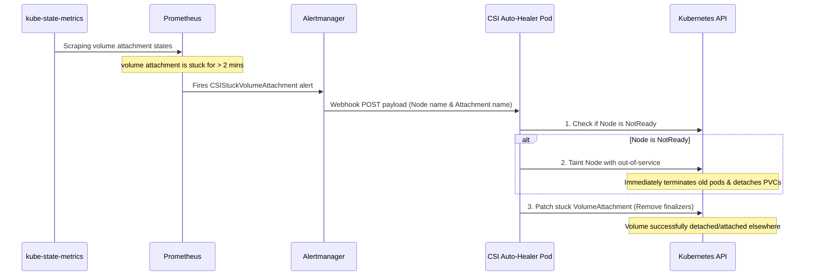

# CSI Stuck Volume Auto-Healer

This directory contains the declarative manifests for the **CSI Stuck Volume Auto-Healer**. It monitors and automatically heals stuck persistent volume attachments and handles non-graceful node shutdowns.

---

## 1. How It Works



---

## 2. Directory Structure

*   `namespace.yaml`: Creates the dedicated `csi-auto-healer` namespace.
*   `rbac.yaml`: Configures the ServiceAccount and ClusterRole with write access to `volumeattachments` and `nodes`.
*   `configmap.yaml`: Holds the inline Python webhook listener (`healer.py`).
*   `deployment.yaml`: Launches the healer pod using a lightweight Alpine base, installing `kubectl`, `python3`, and `jq` dynamically at runtime.
*   `service.yaml`: Exposes the webhook server on port `8080` internally.
*   `prometheusrule.yaml`: Creates the `CSIStuckVolumeAttachment` alert rule targeted at your Prometheus Operator.

---

## 3. Integration with Alertmanager

To route the `CSIStuckVolumeAttachment` alert to this auto-healer, update your `alertmanager.yaml` (or your Vault secret payload for Alertmanager) with the following route and receiver configurations:

### Receiver Configuration
```yaml
receivers:
- name: 'csi-auto-healer-webhook'
  webhook_configs:
  - url: 'http://csi-auto-healer.csi-auto-healer.svc:8080/'
    send_resolved: false
```

### Route Configuration
```yaml
route:
  routes:
  - match:
      alertname: CSIStuckVolumeAttachment
    receiver: 'csi-auto-healer-webhook'
    group_wait: 10s
    group_interval: 10s
    repeat_interval: 5m
```

---

## 4. GitOps Deployment

Since this directory is Kustomize-ready, you can include it directly in your ArgoCD config:

1. Add it as a resource to your root kustomization or ArgoCD application definitions.
2. Reconcile with ArgoCD to deploy.
