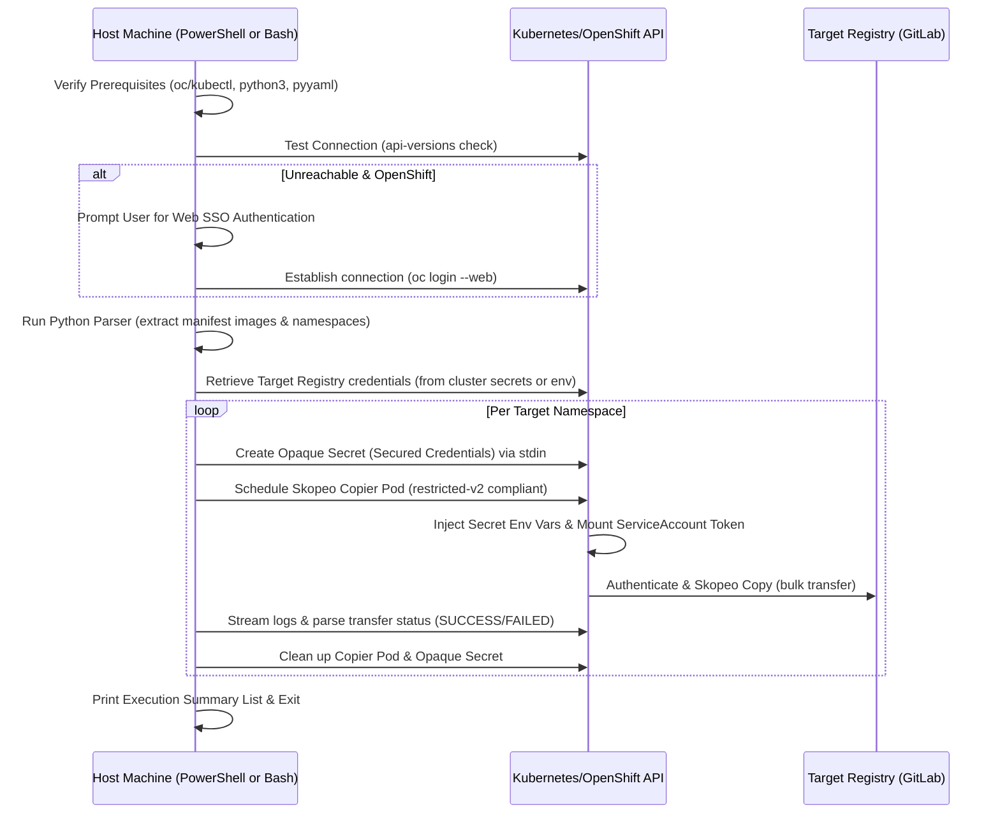

# Kubernetes & OpenShift Container Image Replicator

A production-ready, fully featured container image replication utility designed to scan declarative Kubernetes/OpenShift manifest directories, extract referenced container images, and securely mirror them to your private GitLab Container Registry (or any other target registry) using in-cluster Skopeo copier pods.

Two identical implementations are provided for compatibility across platforms:
1. 📄 **[Sync-ManifestImagesToRegistry.ps1](file:///C:/Users/rclaf/sync/homelab/scripts/image-replicator/Sync-ManifestImagesToRegistry.ps1)** (PowerShell)
2. 📄 **[Sync-ManifestImagesToRegistry.sh](file:///C:/Users/rclaf/sync/homelab/scripts/image-replicator/Sync-ManifestImagesToRegistry.sh)** (Bash)

Both scripts share identical logic, security validations, and execution safety controls, running completely in-memory without requiring any host-based Skopeo installation.

---

## 🏗️ Architecture & Workflow



---

## ⚡ Prerequisites

Ensure the following utilities are installed and available in your environment's `PATH`:

1. **Shell Environment:**
   * **PowerShell script:** Windows PowerShell 5.1 or PowerShell Core 7+.
   * **Bash script:** Bash shell (compatible with Linux, macOS, WSL, or Git Bash).
2. **Cluster CLI:** Either the OpenShift CLI (`oc`) or Kubernetes CLI (`kubectl`).
3. **Python 3:** Python `3.x` with the `pyyaml` module installed (`pip install pyyaml`).
4. **Target Registry Account:** Access to your destination registry (defaults to `registry.apps.okd.claffey.cloud`).

---

## ⚙️ Parameters & Options

| PowerShell Param | Bash Option | Type | Default Value | Description |
| :--- | :--- | :--- | :--- | :--- |
| `ManifestsDir` | `--manifests-dir` | `String` | `../../kubernetes` | Path to the directory containing Kubernetes YAML manifests. |
| `DestRegistry` | `--dest-registry` | `String` | `registry.apps.okd.claffey.cloud` | Destination container registry host. |
| `DefaultProject` | `--default-project` | `String` | `rclaffey/homelab` | GitLab project path prefix for public and flattened images. |
| `CustomProjectPrefix`| `--custom-project-prefix`| `String` | `rclaffey` | GitLab group prefix for custom internal images. |
| `Mode` | `--mode` | `String` | `All` | Selection scope. Options: `All` (both public and custom) or `CustomOnly`. |
| `Flatten` | `--flatten` | `Switch` | `False` | If set, flattens all internal images under `$DefaultProject`. |
| `IncludeNamespace` | `--include-namespace` | `String[]` | `None` | Comma-separated list of namespaces to include in processing. |
| `ExcludeNamespace` | `--exclude-namespace` | `String[]` | `None` | Comma-separated list of namespaces to exclude from processing. |
| `CliType` | `--cli-type` | `String` | `auto` | Forces CLI tool usage. Options: `auto` (prefers `oc`), `oc`, or `kubectl`. |
| `GitLabUser` | `--gitlab-user` | `String` | `root` | GitLab Registry Username. |
| `GitLabToken` | `--gitlab-token` | `SecureString`| `None` | GitLab Secure Access Token or Password. |
| `CopierNamespace` | `--copier-namespace` | `String` | `gitlab-system` | Namespace used to run copier pods for public images. |
| `DryRun` | `--dry-run` | `Switch` | `False` | Outputs source-to-destination mappings without execution. |
| `NonInteractive` | `--non-interactive` | `Switch` | `False` | Bypasses all interactive login prompts (forces clean exit on failures). |

---

## 🔑 Authentication & Credentials Resolution

Credentials for the destination registry are resolved in the following hierarchical order:

1. **Explicit Parameter:** Passed via `-GitLabToken` (PowerShell) or `--gitlab-token` (Bash).
2. **Environment Variables:** Checked via `$env:GITLAB_TOKEN` / `$env:GITLAB_PASSWORD` (PowerShell) or `GITLAB_TOKEN` / `GITLAB_PASSWORD` (Bash).
3. **Auto Cluster Retrieval:** Attempted by reading the `gitlab-gitlab-initial-root-password` secret in the `gitlab-system` namespace.
4. **Interactive Prompt:** If all above fail, the script prompts you to enter the credentials in your interactive terminal.

### Non-Interactive (CI/CD) Automation
To execute in automation scripts:
* Supply the `--non-interactive` or `-NonInteractive` switch.
* Pre-authenticate your cluster console context.
* Inject credentials via environment variables (`GITLAB_TOKEN`).

---

## 🗺️ Destination Mapping Rules

The replicator automatically groups and routes images based on origin:

### 1. Custom / Internal Images
Identified by references containing `image-registry.openshift-image-registry.svc`.
* **Standard Mapping (Default):**
  Mapped to: `<dest-registry>/<custom-project-prefix>/<namespace>/<repository>:<tag>`
  *E.g. `image-registry.openshift-image-registry.svc:5000/bikely/backend:latest` ➡️ `registry.apps.okd.claffey.cloud/rclaffey/bikely/backend:latest`*
* **Flattened Mapping (via `--flatten`):**
  Mapped to: `<dest-registry>/<default-project>/<namespace>-<repository>:<tag>`
  *E.g. `image-registry.../bikely-dev/fitness-app-backend:latest` ➡️ `registry.apps.okd.claffey.cloud/rclaffey/homelab/bikely-dev-fitness-app-backend:latest`*

### 2. Public / External Images
Identified by standard registry names (Docker Hub, GHCR, Quay, etc.).
* **Always Flattened:**
  Mapped to: `<dest-registry>/<default-project>/<flattened-repository-path>:<tag>`
  *E.g. `docker.io/library/postgres:15-alpine` ➡️ `registry.apps.okd.claffey.cloud/rclaffey/homelab/library-postgres:15-alpine`*
  *E.g. `ghcr.io/gethomepage/homepage:v1.13.2` ➡️ `registry.apps.okd.claffey.cloud/rclaffey/homelab/gethomepage-homepage:v1.13.2`*

---

## 🔒 Security & Compliance

* **Dynamic Secret Generation:** Destination credentials are piped directly using stdin (`apply -f -`) to create an ephemeral, namespace-scoped Kubernetes Secret (`skopeo-creds-...`). Credentials never enter command argument logs or plain-text environment arrays of the Pod specifications.
* **Restricted PSS/SCC Compliance:** Overrides are injected during pod execution, making the copier container fully compliant with standard Kubernetes `Restricted` Pod Security Standards and OpenShift `restricted-v2` Security Context Constraints (SCC):
  * `allowPrivilegeEscalation` is disabled (`false`).
  * All Linux capabilities are dropped (`drop: ["ALL"]`).
  * Runs as a non-root container (`runAsNonRoot: true`).
  * `runAsUser` is omitted to allow OpenShift namespaces to dynamically allocate UIDs.
* **Validation Guards:** Extracted image sources, namespaces, and container references are validated against strict regex patterns to prevent command-injection vulnerabilities inside the copier container shell.

---

## 📝 Limitations & Parsing Details

* **Templated Manifests (Helm/Go):** The Python parsing logic is designed to parse strict, valid YAML. Any manifest file containing Helm/Go template expressions (e.g. `{{ .Values.image.tag }}` or other occurrences of `{{` and `}}`) is **silently skipped** to prevent YAML load failures. Run your templates through Helm template rendering or Kustomize before scanning them with this script.
* **Auto-retrieval Namespace:** The automatic retrieval of the initial root password (step 3 of credential resolution) is hardcoded to look in the `gitlab-system` namespace for the `gitlab-gitlab-initial-root-password` secret, regardless of the value passed to the `--copier-namespace` parameter.
* **No local Skopeo requirement:** All skopeo commands are run inside the target Kubernetes/OpenShift cluster inside a transient `skopeo-copier` Pod using the `quay.io/containers/skopeo:latest` container image.

---

## 📖 Examples

### 1. Perform a Dry-Run
* **PowerShell:**
  ```powershell
  .\Sync-ManifestImagesToRegistry.ps1 -DryRun
  ```
* **Bash:**
  ```bash
  ./Sync-ManifestImagesToRegistry.sh --dry-run
  ```

### 2. Copy Only Custom Images
* **PowerShell:**
  ```powershell
  .\Sync-ManifestImagesToRegistry.ps1 -Mode CustomOnly
  ```
* **Bash:**
  ```bash
  ./Sync-ManifestImagesToRegistry.sh --mode CustomOnly
  ```

### 3. Apply Namespace Filters
* **PowerShell:**
  ```powershell
  .\Sync-ManifestImagesToRegistry.ps1 -IncludeNamespace @("bikely", "uptime-kuma")
  ```
* **Bash:**
  ```bash
  ./Sync-ManifestImagesToRegistry.sh --include-namespace "bikely,uptime-kuma"
  ```

### 4. Authenticate Using a Token (PowerShell)
```powershell
$token = Read-Host -AsSecureString -Prompt "Enter GitLab Registry Token"
.\Sync-ManifestImagesToRegistry.ps1 -GitLabToken $token
```
